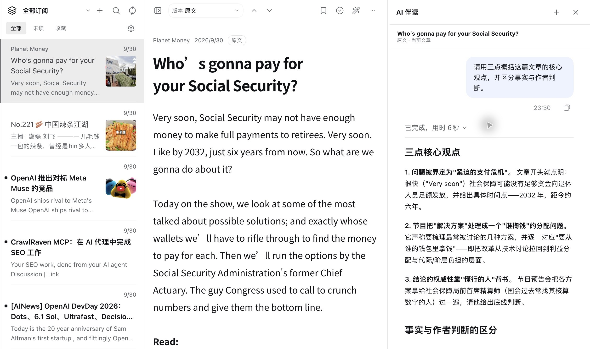
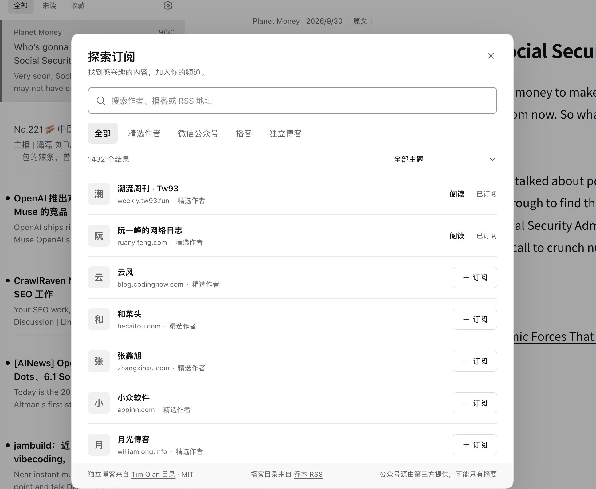

# 乔木 RSS · qiaomu-rss-dsh

**中文** · [English](#english)

在 DeepSeek Harness 里订阅和阅读 RSS，并用宿主原生 AI 对话伴读当前文章。

Read RSS inside DeepSeek Harness and discuss the current article in its native AI conversation.

**[下载 v0.5.1 安装包](https://github.com/joeseesun/qiaomu-rss-dsh/releases/tag/v0.5.1)** · [安装步骤](#安装) · [查看真实界面](#真实界面)



*本机 DeepSeek Harness 桌面构建实拍：打开 Planet Money 文章，发送「概括要点」，右侧原生 AI 对话返回了对应文章的三点概括。*

这是公开源码的社区插件，并非 DeepSeek 官方维护或背书。预构建安装包见 [GitHub Releases](https://github.com/joeseesun/qiaomu-rss-dsh/releases)；目前不发布 npm 包。已在 DeepSeek Harness 0.2.0-rc.2 的 Desktop 和隔离 Web profile 中验证。

## 能做什么

| 功能 | 使用方式 |
| --- | --- |
| 乔木精选与个人订阅 | 从左上角搜索并切换频道，自动加载该频道的新文章；在探索页添加 RSS/Atom 源，导入或导出 OPML |
| 阅读文章 | 切换原文、译文和乔木改写；支持未读、收藏、搜索与媒体内容 |
| AI 伴读 | 点击文章工具栏的魔法棒，或选中正文，右侧直接打开 Harness 原生对话；默认工作区自动连接当前文章，选文全文作为上下文，输入框只显示简短的可编辑引用预览 |
| 插件设置 | 调整阅读外观和乔木服务地址；用弹窗编辑订阅、重命名或取消分组，管理 OPML 与快捷提示词，并查看关于与打赏信息 |
| Agent 工具 | 提供频道、文章、搜索、订阅、刷新和阅读版本相关的八个 `rss_*` 工具 |

## 真实界面

截图来自本机已安装的 DeepSeek Harness 桌面开发构建，保留了实际文章、订阅源和操作结果；画面不代表每个 Release 包都已在所有平台验证。

### 阅读与乔木改写

从订阅列表打开播客文章，切换到「乔木改写」阅读。文章图片和正文均来自实际订阅内容。


### 探索订阅

打开「探索订阅」，可按类别查找 RSS 源，并区分已订阅与可添加的频道。



切换频道时先显示已缓存文章，再自动拉取该频道的新内容；刷新按钮仍可手动强制更新。切换文章时，阅读区用轻量骨架显示加载状态。默认阅读版本仅在当前文章有内容时生效，缺失时自动选择其他已有版本或原文；手动选择缺失版本仍可调用 Harness 生成。文章与伴读之间的分割线可拖动，也可用方向键微调、双击复位。打开伴读时文章列表保持可见，文章左上角也可打开频道列表。伴读输入框上方的快捷提示词可横向滚动点选并直接发送；末端的 + 可直达设置新增提示词。已有手写草稿时不会覆盖或误发。本机个人提示词保存在插件的浏览器存储中，可在设置中编辑。探索订阅包含来自原版乔木 RSS 目录的 73 个播客 RSS 源；订阅后可使用文章中的音频附件播放。插件不提供 Obsidian 式笔记、划线保存或日记写入。

## 安装

需要 DeepSeek Harness 0.2.0-rc.2 的 `dsh` CLI。下载 [v0.5.1 Release](https://github.com/joeseesun/qiaomu-rss-dsh/releases/tag/v0.5.1) 中的 `.tgz` 和同名 `.sha256` 文件，在下载目录执行：

```bash
shasum -a 256 -c qiaomu-rss-dsh-0.5.1.tgz.sha256
dsh plugin --profile desktop add "$PWD/qiaomu-rss-dsh-0.5.1.tgz"
```

使用命令行 Web 界面时，把 `desktop` 换为 `web`。安装后重启对应的 Harness profile，在侧边栏打开「乔木 RSS」。[官方插件安装说明](https://github.com/deepseek-ai/deepseek-harness/blob/master/docs/user/develop/basic/publish.md)介绍了 bundle 与 profile 的关系。插件依赖 Harness 已配置的模型与账号；默认无需再选工作区。

## 开发

需要 Node.js 22 或更高版本，以及已安装的 DeepSeek Harness。克隆后执行：

```bash
git clone https://github.com/joeseesun/qiaomu-rss-dsh.git
cd qiaomu-rss-dsh
npm ci
npm run build
npm test
```

`src/` 是源码；`lib/` 是随 Git 仓库提交的宿主与客户端构建产物，供 DSH bundle 加载。修改源码后请重新构建，并一并提交更新后的 `lib/`。包名 `qiaomu-rss-dsh` 必须与 `cordis.patch.yml` 中的 `name` 保持一致。

此前版本已在本地 Desktop profile 验证读取、伴读和可调分割线，并通过隔离 Web profile 的安装、配置和启动检查；v0.5.1 新名称安装包已完成打包与校验，尚未在 Harness profile 中重新安装验证。`private: true` 仅阻止误发 npm，不限制 GitHub 源码或 Release 下载。正式使用时请安装 Release 包；从 GitHub 源码构建适合参与开发。

## 数据与来源

- 订阅与阅读状态保存在 Harness home 的 `storages/qiaomu-rss/data.json`，不在本仓库。升级时不会清空旧数据。
- 乔木精选读取 [乔木 AI RSS](https://github.com/joeseesun/qiaomu-ai-rss) 的公开接口；个人订阅由插件抓取。
- 内置独立博客源清单来自 [chinese-independent-blogs](https://github.com/timqian/chinese-independent-blogs)，其 MIT 声明保留在 [`vendor/chinese-independent-blogs/LICENSE`](vendor/chinese-independent-blogs/LICENSE)。
- 播客 RSS 推荐地址来自 [乔木 AI RSS 的源目录](https://github.com/joeseesun/qiaomu-ai-rss/blob/main/src/data/tidings.json)；第三方源的可用性和全文/音频内容由各发布方决定。
- 「探索订阅 → 海外播客原文」可搜索 [乔木 Podscribe API](https://api.qiaomu.ai/podscribe/docs) 收录的海外节目，按节目浏览单集并获取完整原文转写。已获取的单集出现在「海外播客原文」频道，可继续翻译、改写或在 AI 伴读中引用。覆盖范围随上游公开目录变化；接口不可用或无转写时会显示错误，不会生成虚构原文。
- AI 伴读使用 DeepSeek Harness 当前可用的模型与原生会话；模型服务的配置与费用由 Harness 管理。

问题与改进建议请通过 [GitHub Issues](https://github.com/joeseesun/qiaomu-rss-dsh/issues) 提交。本项目采用 [GPL-3.0-only](LICENSE) 许可。

---

<a id="english"></a>

## English

The [live desktop screenshots](#真实界面) show a real feed, the rewritten reading view, subscription discovery, and an article-specific native AI response from a locally installed development build. [Download v0.5.1](https://github.com/joeseesun/qiaomu-rss-dsh/releases/tag/v0.5.1) or follow the install steps above.

Qiaomu RSS brings curated and personal RSS/Atom feeds into DeepSeek Harness. Read the original, translated, or rewritten article; manage unread items and favorites; import/export OPML; and open a native Harness AI conversation beside the article with its reading context attached. The companion opens directly in the default workspace. The article/chat divider is resizable.

This is an open-source community plugin, not maintained or endorsed by DeepSeek. A prebuilt tarball is available from [GitHub Releases](https://github.com/joeseesun/qiaomu-rss-dsh/releases); it is not published to npm. With the DeepSeek Harness 0.2.0-rc.2 CLI, download the `.tgz` and `.sha256` files, verify them with `shasum -a 256 -c qiaomu-rss-dsh-0.5.1.tgz.sha256`, then run `dsh plugin --profile desktop add /absolute/path/to/qiaomu-rss-dsh-0.5.1.tgz` and restart the profile. Use `web` instead of `desktop` for the Web profile. The previous package was installed and booted in an isolated Web profile, and its Desktop reading and AI-companion flow was checked in the installed app. The renamed v0.5.1 tarball has passed packing and checksum verification but has not yet been reinstalled in a Harness profile. For development, use Node.js 22+ and run `npm ci`, `npm run build`, and `npm test`. The generated `lib/` files are committed because the DSH bundle loads them.

Reading data lives in the user's Harness home under `storages/qiaomu-rss/data.json`, outside this repository. The curated feed uses the public [Qiaomu AI RSS](https://github.com/joeseesun/qiaomu-ai-rss) API. AI conversations use the host's configured model and account. Obsidian note, highlight-saving, and daily-note features are intentionally absent. Source is licensed under [GPL-3.0-only](LICENSE); the bundled blog list retains its separate MIT notice.
